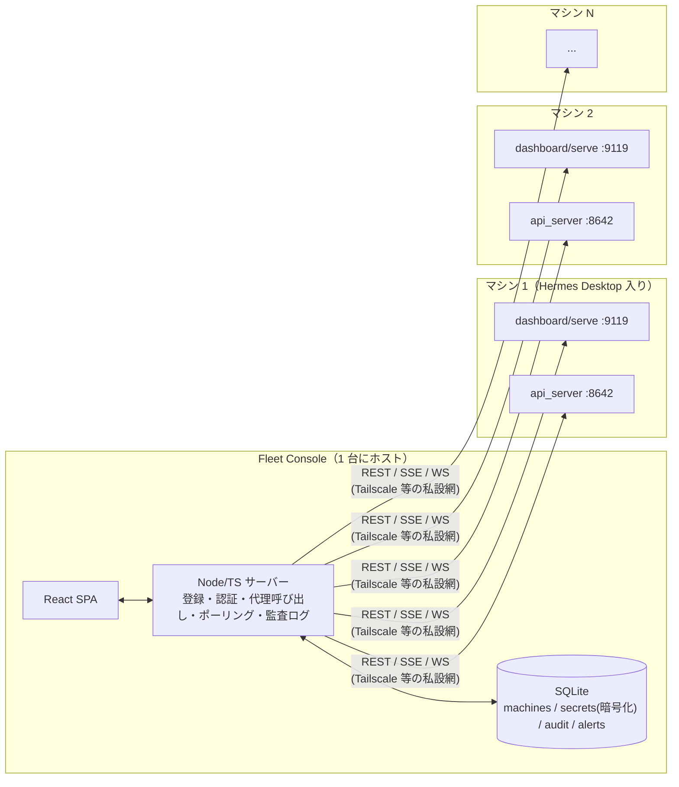

# Hermes Desktop 複数マシン一元管理アプリ — プラニング

作成日: 2026-09-16
状態: **ドラフト（レビュー待ち）**。「未確定事項」の回答を受けてから実装に着手する。

---

## 0. 要約

- 目的: Hermes Desktop（= `hermes serve` バックエンド）を入れた複数マシンを **1 画面で監視し、まとめて操作** できるアプリを作る。
- 前提調査の結論: 各マシンには既に管理用 HTTP API が 2 系統ある（ダッシュボード API と API サーバー）。**マシン側に独自エージェントを新規に入れる必要はない**。作るのは、それらを束ねる薄い「コントロールプレーン」＋UI。
- 推奨形態: **自前ホストの Web コンソール**（Node/TypeScript + React、単一コンテナ）。理由は §3。
- MVP のスコープ: マシン登録 / 一覧ヘルス表示 / ゲートウェイ起動停止再起動 / 一括アップデート / 任意のマシン群へプロンプト送信と結果の並列表示。§5 参照。

---

## 1. 調査で分かったこと（設計の根拠）

### 1.1 Hermes Desktop の構造

| 項目 | 内容 |
|---|---|
| アプリ本体 | Electron + React。バックエンドとして headless な `hermes serve`（Python）を子プロセスで起動 |
| 通信 | `tui_gateway` の JSON-RPC over WebSocket。既定は `127.0.0.1:9119` |
| 既存のマルチ接続機能 | Settings → Gateways に Local / Remote(token, OAuth) / SSH / Hermes Cloud を登録できる。**ただしワークスペースは常に 1 ゲートウェイのみアクティブ**。複数の同時表示・一括操作は未実装（Issue #45779、P3、open） |
| 既存の「まとめて更新」 | 登録済みゲートウェイの一括アップデートは Desktop にある（Cloud は除外） |
| ゲートウェイ間連携 | `hermes peer add <name> --url http://host:8642 --key <API_SERVER_KEY>` で別マシンのエージェント同士がメッセージ可能 |

### 1.2 各マシンが公開できる API（これを束ねる）

**A. ダッシュボード / serve（既定ポート 9119）** — 管理操作の主戦場

- 認証なし: `GET /api/status`（バージョン、ゲートウェイ状態、セッション数、メモリ/ディスク圧迫）
- 認証あり（抜粋）:
  - ゲートウェイ: `POST /api/gateway/start|stop|restart`
  - システム: `GET /api/system/stats`（OS/CPU/メモリ/ディスク/uptime）
  - 更新: `GET /api/hermes/update/check`、`POST /api/hermes/update`
  - 診断: `POST /api/ops/doctor|security-audit|backup`（バックグラウンド実行、`/api/actions/{name}/status` で追跡）
  - ログ: `GET /api/logs?file=&level=&lines=`
  - cron: `/api/cron/jobs` CRUD + pause/resume/trigger
  - 設定: `GET/PUT /api/config`、`GET/PUT/DELETE /api/env`（`?profile=` でプロファイル指定可）
  - セッション: `/api/sessions`（一覧・検索・エクスポート・削除）
  - スキル/MCP/チャネル/ペアリング等
  - WebSocket: `/api/ws`（チャット）、`/api/pty`（TUI、POSIX のみ）
- 認証方式: ループバック以外にバインドすると **fail-closed で認証必須**。提供者は (1) ユーザー名/パスワード（scrypt + HMAC 署名の stateless セッション、LAN/VPN 向け）(2) Nous Portal OAuth（アクセストークン 15 分、v1 はリフレッシュ無し）(3) 自前 OIDC（リフレッシュあり）(4) プラグインで Bearer トークン提供者を追加可能

**B. API サーバー（既定ポート 8642、`API_SERVER_ENABLED=true`）** — エージェント操作の主戦場

- 認証: `Authorization: Bearer <API_SERVER_KEY>` の静的キー。ヘッドレスなクライアントに最も扱いやすい
- `GET /health`（無認証 liveness）、`GET /health/detailed`（設定・DB・モデル・ディスク・実行中 run）
- `POST /v1/runs` → `GET /v1/runs/{id}/events`（SSE）/ `stop` / `approval`。冪等キー対応
- `/api/sessions/*`（作成・履歴・fork・単発チャット）
- `/api/jobs/*`（スケジュールジョブ CRUD）
- `GET /v1/capabilities`（API 面の機械可読な記述 → バージョン差の吸収に使う）
- 制約: 同時 run 上限 10（設定可）、ファイルアップロード不可

### 1.3 セキュリティ上の前提（公式ドキュメントより）

- API サーバーとダッシュボードは **端末コマンド実行を含む全権** を渡す。公開インターネットに素で出さない。
- 推奨: Tailscale/WireGuard 等の私設ネットワークにバインド、非 root、コンテナ系 terminal backend、`approvals.unattended_mode: deny`、YOLO 無効。
- ダッシュボードは `Host` ヘッダ厳格一致（DNS rebinding 対策）。リバースプロキシ経由なら `dashboard.public_url` と `trusted_proxies` の設定が必要。

---

## 2. 前提と、確認したい未確定事項

**作業上の前提（回答が無ければこの前提で進める）**

1. 管理対象は 2〜20 台程度の個人／小規模チーム所有マシン。数百台規模の運用ツールではない。
2. 全マシンは同一の私設ネットワーク（LAN または Tailscale）から到達できる。
3. 各マシンで `hermes serve`（またはダッシュボード）を **ループバック以外にバインドし直し、認証を設定できる**。Desktop が自動起動する `127.0.0.1:9119` のままでは外から届かない。
4. 利用者は当面 1 人（自分）。チーム利用は後回し。

**未確定事項（回答が設計に影響する）**

| # | 質問 | 影響 |
|---|---|---|
| Q1 | 台数と OS の内訳（Windows / macOS / Linux）は？ | 登録スクリプトの対応 OS、サービス管理（systemd / launchd / Windows） |
| Q2 | マシン同士のネットワークは LAN / Tailscale / インターネット越しのどれ？ | 認証方式（パスワードで足りるか、OIDC が必要か）、TLS の要否 |
| Q3 | アプリの形態の希望: (a) ブラウザで開く Web コンソール (b) 手元の PC 用デスクトップアプリ (c) Hermes Desktop のプラグイン | §3 で比較。推奨は (a) |
| Q4 | 「操作」で最優先なのはどれ？ ①監視・状態確認 ②一括アップデート/再起動 ③複数マシンへプロンプト送信 ④設定/スキルの配布 ⑤cron・セッションの横断管理 | MVP の順番 |
| Q5 | 各マシンで既に Telegram 等のメッセージングゲートウェイを動かしている？ | 通知（オフライン検知等）を Hermes 自身の配信経路に乗せられる |
| Q6 | 利用者は自分だけ？ 将来チームで共有？ | コンソール自体の認証設計（単一管理者 vs OIDC） |

---

## 3. 形態の比較と推奨

| 案 | 概要 | 長所 | 短所 |
|---|---|---|---|
| **(a) 自前ホスト Web コンソール（推奨）** | Node/TS の小さなサーバー + React SPA。マシン登録とシークレットはサーバー側に保持し、各マシンの API を代理呼び出し | どの端末（スマホ含む）からも見える／常駐してポーリング・アラートが出せる／既存 API を呼ぶだけで済む／後で Electron/Tauri に包める | ホスト先が 1 台必要（NAS・VPS・手元 PC のどれかで可） |
| (b) 専用デスクトップアプリ（Tauri/Electron） | (a) の UI をローカルアプリ化 | インストールだけで使える | 閉じている間は監視できない／マシン間で設定が同期しない／(a) より工数増 |
| (c) Hermes Desktop プラグイン | Desktop Plugin SDK（ESM 1 ファイル、ホットリロード）でページを追加 | 既存 UI に溶け込む | SDK はプラグインに **トークンのバイトを渡さない**（`host.connections()` はラベルと種別のみ）ため、他ゲートウェイの API を自由に叩けるか未確認。上流仕様に強く依存 |
| (d) 何も作らず既存機能で済ます | Desktop の Gateways 登録 + `hermes peer` | 工数ゼロ | 同時表示・一括操作・アラートが無い。2〜3 台ならこれで足りる可能性はある |

**推奨: (a)。** 「一元管理・操作」の本質は横断表示と一括操作であり、それは常駐する集約サーバーが最も素直に実現できる。(c) は魅力的だが SDK の制約を確認するスパイクが必要で、確認できた時点で (a) のフロントを Desktop プラグインとして再パッケージする道も残る。

(d) について正直に言うと、台数が 2〜3 台で「見たい時に見る」だけなら Desktop の既存機能で十分。作る価値が出るのは「複数台を同時に眺めたい」「まとめて更新・再起動したい」「落ちたら気づきたい」のいずれかがある場合。

---

## 4. アーキテクチャ（案 (a)）



**構成方針**

- **マシン側に追加ソフトを入れない。** 使うのは Hermes 標準の 2 API のみ。登録時に「有効化チェックリスト」（§6）を案内する。
- **サーバーが唯一の秘密保持者。** API キーやダッシュボードのセッションはサーバー側で暗号化保存。ブラウザにはマシンの認証情報を渡さない。
- **代理呼び出し（proxy）＋ 集約。** `GET /fleet/overview` のような集約エンドポイントは、各マシンの `/api/status`・`/health/detailed`・`/api/system/stats` を並列に叩いて 1 レスポンスにまとめる。
- **ポーリングは控えめ。** 既定 30 秒、画面を開いている間だけ短縮（5〜10 秒）。SSE で UI に押し出す。
- **バージョン差の吸収。** 各マシンの `/v1/capabilities` と `/api/status` のバージョンを保存し、未対応 API はボタンを無効化する（Hermes は更新が速い）。

**技術スタック（最小）**

| 層 | 選定 | 理由 |
|---|---|---|
| サーバー | Node 22 + TypeScript + Hono（または Fastify） | SSE/WS 中継と並列 fetch が簡潔。単一バイナリ化・Docker 化が容易 |
| DB | SQLite（better-sqlite3） | 台数規模に対して十分。バックアップがファイルコピーで済む |
| フロント | React + Vite + TanStack Query | Hermes 自身のダッシュボード／Desktop と同じ系統で、将来プラグイン化しやすい |
| 配布 | Docker イメージ 1 つ + `docker compose` | NAS/VPS/手元 PC どこでも同じ手順 |

Python（FastAPI）で書く選択肢もある（Hermes 本体が Python）。Hermes のコードを import して再利用したい場面が出るなら Python に切り替える。現時点では API 越しにしか触らないので言語は問わず、フロントと同じ TS に寄せる。

**認証の使い分け（重要な設計判断）**

| 経路 | 用途 | 認証 | 備考 |
|---|---|---|---|
| API サーバー :8642 | プロンプト送信 / run 監視 / jobs / sessions / health | 静的 Bearer キー | ヘッドレスに最適。**主経路** |
| ダッシュボード :9119 | ゲートウェイ起動停止 / 更新 / doctor / ログ / system stats / config | ユーザー名+パスワード提供者でログインしてセッション取得 | OAuth(Nous) は 15 分で切れリフレッシュ無し → ヘッドレス不向き。OIDC はリフレッシュ可。**ログイン手順は Phase 0 でスパイク検証** |

---

## 5. スコープとフェーズ

### Phase 0 — スパイク（1〜2 日）　→ 検証: 3 つの YES/NO を確定する

1. ダッシュボードの **パスワード提供者に対してプログラムからログインし、セッションを保持して `/api/gateway/restart` を呼べる** か。（エンドポイントとクッキー仕様の実確認）
2. API サーバーの `/v1/runs` + SSE を **2 台同時** に扱い、イベントを 1 つの UI に流せるか。
3. Windows 機で `hermes serve --host <tailscale-ip>` と `API_SERVER_ENABLED=true` を常駐させられるか（サービス化手順）。

→ 1 が NO なら「管理操作は SSH 経由で `hermes gateway restart` を叩く」に切り替える（Desktop の SSH 接続と同じ発想）。

### Phase 1 — MVP（監視 + 基本操作）

| 機能 | 検証（受け入れ基準） |
|---|---|
| マシン登録（名前・URL 2 つ・認証情報・タグ）と接続テスト | 登録画面から Test を押すと 9119/8642 の両方に到達可否と Hermes バージョンが表示される |
| フリート一覧 | 各マシンのカードに online/offline、バージョン、ゲートウェイ状態、アクティブセッション数、CPU/メモリ/ディスク、更新有無が出る。オフライン機は 60 秒以内に赤くなる |
| 単体・一括: ゲートウェイ start/stop/restart | 3 台選択 → restart → 全台で `/api/status` の gateway 状態が running に戻る。実行前に確認ダイアログ |
| 単体・一括: `hermes update` | 実行後、各マシンのバージョンが更新される。進行はアクション状態 API で追跡 |
| プロンプト送信（1 台 / 複数台） | 選択した N 台に同じプロンプトを `/v1/runs` で投げ、SSE の進捗と最終回答を並べて表示。stop ボタンで中断できる |
| 監査ログ | 誰が・いつ・どのマシンに・何を実行したかが残る |
| コンソール自体の認証 | 単一管理者パスワード（初回起動時設定）。未ログインでは何も見えない |

### Phase 2 — 横断管理

- セッション横断検索（各マシンの `/api/sessions/search` を集約）
- cron/jobs の横断一覧・作成・一時停止（`/api/cron/jobs`、`/api/jobs`）
- ログの複数台同時 tail
- アラート: オフライン、ディスク/メモリ圧迫、更新あり。通知先は Hermes 自身の cron/Telegram 配信を使う（Q5）か、Webhook で外部へ

### Phase 3 — 配布・同期

- 設定断片（`config.yaml` の指定キー）・`.env` の一部・スキル・MCP サーバー定義を選択マシン群へ push（`PUT /api/config`、`/api/skills/hub/install` 等）。差分プレビュー → 適用の 2 段階
- プロファイルのエクスポート/インポートによる「テンプレ機」の複製
- `hermes peer` の登録をコンソールから一括投入（マシン同士のメッシュ化）

### 明示的にやらないこと

- Hermes / Hermes Desktop 本体の **リモートインストール**（初回導入は各マシンで手動。§6 のチェックリストのみ提供）
- Hermes Desktop の GUI 自体の遠隔操作（画面共有的なもの）
- 数百台規模のスケール、RBAC、マルチテナント
- 自前の LLM 呼び出し。エージェント実行はすべて各マシンの Hermes に委ねる

---

## 6. マシン側の有効化チェックリスト（登録時に案内する内容）

各マシンで 1 回だけ実施する。

```bash
# 1. API サーバーを有効化（~/.hermes/.env）
API_SERVER_ENABLED=true
API_SERVER_KEY=<32 バイト以上のランダム>
API_SERVER_HOST=<Tailscale/LAN の IP>   # 既定は 127.0.0.1
API_SERVER_PORT=8642

# 2. ダッシュボード/serve を私設網にバインドし、パスワード認証を設定
HERMES_DASHBOARD_BASIC_AUTH_USERNAME=admin
HERMES_DASHBOARD_BASIC_AUTH_PASSWORD_HASH="scrypt$..."
HERMES_DASHBOARD_BASIC_AUTH_SECRET=<32 バイト以上>   # 固定にするとセッションが再起動をまたいで有効
hermes serve --host <Tailscale/LAN の IP> --port 9119    # サービス化して常駐

# 3. 安全側の既定
#   approvals.unattended_mode: deny / YOLO 無効 / 非 root / terminal backend は docker 等
```

- Windows は `%LOCALAPPDATA%\hermes` 配下。常駐はタスクスケジューラかサービス化（Phase 0 で手順を確定）。
- 公開インターネット越しにするなら、TLS 終端付きリバースプロキシ + OIDC を必須にする。パスワード認証は VPN 内限定。

---

## 7. リスクと対策

| リスク | 対策 |
|---|---|
| Hermes の API が頻繁に変わる（Desktop は 2026-06 公開、peer は v0.21 追加など） | 対応バージョンをピン留めし、`/v1/capabilities` と `/api/status` のバージョンで機能を出し分ける。E2E テストは実機 1 台で毎リリース回す |
| ダッシュボード認証がヘッドレスで扱いにくい | Phase 0 で確定。ダメなら SSH フォールバック |
| コンソールが「全マシンの端末権限」を持つ単一障害点になる | 秘密は暗号化保存、コンソール自体に認証、破壊的操作は確認+監査ログ、私設網のみ |
| 一括操作の事故（全台 stop 等） | 一括は必ず対象一覧を表示して確認。`update` は 1 台で成功してから残りに展開する「カナリア」オプション |
| Desktop 起動中のローカル `hermes serve`（127.0.0.1:9119）と外向き serve の二重起動 | 同一マシンで別プロファイル/別ポートを使うか、Desktop 側を Remote 接続に切り替える手順を明記 |

---

## 8. リポジトリ構成案（実装時）

```
.
├── apps/
│   ├── server/      # Hono + TypeScript。/api/fleet/*, /api/machines/*, SSE 中継
│   └── web/         # React + Vite
├── packages/
│   └── hermes-client/   # 9119 / 8642 の型付きクライアント（capabilities で機能検出）
├── docker-compose.yml
└── docs/planning/   # 本書
```

---

## 9. 次のアクション

1. §2 の Q1〜Q6 に回答をもらう（特に Q3 形態、Q4 優先順位）。
2. Phase 0 のスパイクを実機 2 台（できれば OS 混在）で実施し、結果を本書に追記。
3. Phase 1 の受け入れ基準を Issue 化して着手。

---

## 参考（調査ソース）

- Hermes Desktop 公式: https://hermes-agent.nousresearch.com/docs/user-guide/desktop
- 複数インスタンス接続: https://hermes-agent.nousresearch.com/docs/user-guide/multi-connection-desktop
- 複数ゲートウェイ運用: https://hermes-agent.nousresearch.com/docs/user-guide/multi-profile-gateways
- API サーバー: https://hermes-agent.nousresearch.com/docs/user-guide/features/api-server
- Web ダッシュボード（REST/認証）: https://hermes-agent.nousresearch.com/docs/user-guide/features/web-dashboard
- セキュリティ: https://hermes-agent.nousresearch.com/docs/user-guide/security
- CLI リファレンス: https://hermes-agent.nousresearch.com/docs/reference/cli-commands
- Desktop ソース: https://github.com/NousResearch/hermes-agent/tree/main/apps/desktop
- マルチゲートウェイ タブ表示の要望（open, P3）: https://github.com/NousResearch/hermes-agent/issues/45779
- リリース報道: https://the-decoder.com/nous-research-releases-hermes-desktop-an-open-source-ai-agent-for-every-platform/ 、https://www.marktechpost.com/2026/06/03/nous-research-releases-hermes-desktop-a-native-cross-platform-front-end-for-hermes-agent-v0-15-2-with-streaming-tool-output/
