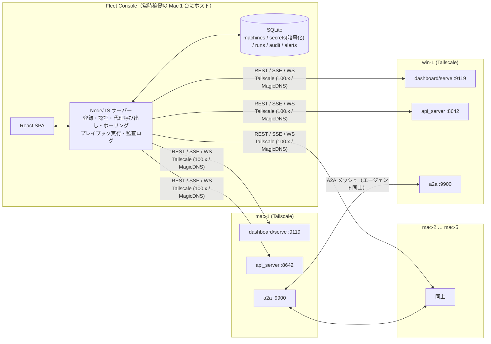

# Hermes Desktop 複数マシン一元管理アプリ — プラニング

作成日: 2026-09-16 / 更新: 2026-09-16（要件回答を反映、Phase 0〜3 の実装を追記）
状態: **実装中。Phase 0（ソース調査）完了、Phase 1〜3 と cron・セッション横断の初版を実装済み（モックで検証、実機は未検証）。** 使い方は [README](../../README.md)。

---

## 0. 要約

- 目的: Hermes Desktop（= `hermes serve` バックエンド）を入れた **Mac 5 台 + Windows 11 1 台** を、1 つの Web コンソールから監視・一括操作・オーケストレーションする。
- 前提調査の結論: 各マシンには既に管理用 HTTP API が 3 系統ある（ダッシュボード :9119、API サーバー :8642、A2A :9900）。**マシン側に独自エージェントを新規に入れる必要はない**。作るのは、それらを束ねる薄い「コントロールプレーン」＋UI。
- 形態: **自前ホストの Web コンソール**（Node/TypeScript + React + SQLite、単一プロセス／単一コンテナ）。Mac のうち常時稼働の 1 台にホストし、Tailscale 経由でどこからでも開く。
- 優先順位（ユーザー指定）: 監視 → 一括更新 → プロンプト送信 → 設定配布 → cron・セッション横断 → オーケストレーション。この順でフェーズを切る（§5）。

---

## 1. 調査で分かったこと（設計の根拠）

### 1.1 Hermes Desktop の構造

| 項目 | 内容 |
|---|---|
| アプリ本体 | Electron + React。バックエンドとして headless な `hermes serve`（Python）を子プロセスで起動 |
| 通信 | `tui_gateway` の JSON-RPC over WebSocket。既定は `127.0.0.1:9119` |
| 既存のマルチ接続機能 | Settings → Gateways に Local / Remote(token, OAuth) / SSH / Hermes Cloud を登録できる。**ただしワークスペースは常に 1 ゲートウェイのみアクティブ**。複数の同時表示・一括操作は未実装（Issue #45779、P3、open） |
| 既存の「まとめて更新」 | 登録済みゲートウェイの一括アップデートは Desktop にある（Cloud は除外） |
| 設定の置き場 | macOS: `~/.hermes`、Windows: `%LOCALAPPDATA%\hermes`。`config.yaml` と `.env` |

### 1.2 各マシンが公開できる API（これを束ねる）

**A. ダッシュボード / serve（既定ポート 9119）** — 管理操作の主戦場

- 認証なし: `GET /api/status`（バージョン、ゲートウェイ状態、セッション数、メモリ/ディスク圧迫）
- 認証あり（抜粋）:
  - ゲートウェイ: `POST /api/gateway/start|stop|restart`
  - システム: `GET /api/system/stats`（OS/CPU/メモリ/ディスク/uptime）
  - 更新: `GET /api/hermes/update/check`、`POST /api/hermes/update`
  - 診断: `POST /api/ops/doctor|security-audit|backup`（バックグラウンド実行、`/api/actions/{name}/status` で追跡）
  - ログ: `GET /api/logs?file=&level=&lines=`
  - cron: `/api/cron/jobs` CRUD + pause/resume/trigger
  - 設定: `GET/PUT /api/config`、`GET/PUT/DELETE /api/env`（`?profile=` でプロファイル指定可）
  - セッション: `/api/sessions`（一覧・検索・エクスポート・削除）
  - スキル: `/api/skills`、`/api/skills/hub/install|update`。MCP: `/api/mcp/servers`
  - WebSocket: `/api/ws`（チャット）、`/api/pty`（TUI、POSIX のみ → Windows 機では使えない）
- 認証方式: ループバック以外にバインドすると **fail-closed で認証必須**。提供者は (1) ユーザー名/パスワード（scrypt + HMAC 署名の stateless セッション、LAN/VPN 向け）(2) Nous Portal OAuth（アクセストークン 15 分、リフレッシュ無し）(3) 自前 OIDC（リフレッシュあり）(4) プラグインで Bearer トークン提供者を追加可能

**B. API サーバー（既定ポート 8642、`API_SERVER_ENABLED=true`）** — エージェント操作の主戦場

- 認証: `Authorization: Bearer <API_SERVER_KEY>` の静的キー。ヘッドレスなクライアントに最も扱いやすい
- `GET /health`（無認証）、`GET /health/detailed`（設定・DB・モデル・ディスク・実行中 run）
- `POST /v1/runs` → `GET /v1/runs/{id}/events`（SSE）/ `stop` / `approval`。`Idempotency-Key` 対応
- `/api/sessions/*`（作成・履歴・fork・単発チャット）、`/api/jobs/*`（スケジュールジョブ）
- `GET /v1/capabilities`（API 面の機械可読な記述 → バージョン差の吸収に使う）
- 制約: 同時 run 上限 10（設定可）、ファイルアップロード不可

**C. A2A（既定ポート 9900、`hermes tools enable a2a`）** — エージェント同士の連携

- 標準 Agent2Agent プロトコル v1.0。`GET /.well-known/agent-card.json` で能力を公開、`POST /` の JSON-RPC で `SendMessage` 等
- エージェント内ツール: `a2a_call(agent, message)`、`a2a_discover(url)`、`a2a_orchestrate(capability, message, mode)`（能力を持つピアにタスクを配る）
- ピアは `config.yaml` の `a2a_agents:` に URL と Bearer トークンで登録。トークン無しならループバックのみ
- ループ防止（1 コンテキスト既定 5 ターン）、監査ログ `~/.hermes/a2a_audit.jsonl`

### 1.3 マシン間オーケストレーションに使える／使えないもの

| 機構 | 範囲 | 備考 |
|---|---|---|
| `delegate_task`（サブエージェント） | **同一マシン内のみ** | 並列 10、ネスト深さ既定 1 |
| `hermes kanban` | **同一マシン内のプロファイルのみ** | ディスパッチャは `profile_exists` で判定。リモート配布は無し |
| `hermes peer dm` | マシン間 | 相手の API サーバー :8642 経由で 1 ターン実行し返答を返す |
| A2A（`a2a_call` / `a2a_orchestrate`） | マシン間 | 標準プロトコル。能力ベースのファンアウトあり |
| API サーバー `/v1/runs` | マシン間（コンソールから） | 本コンソールが直接使う経路 |

### 1.4 セキュリティ上の前提（公式ドキュメントより）

- API サーバー／ダッシュボード／A2A は **端末コマンド実行を含む全権** を渡す。公開インターネットに素で出さない。
- 推奨: Tailscale 等の私設ネットワークにバインド、非 root、`approvals.unattended_mode: deny`、YOLO 無効。
- ダッシュボードは `Host` ヘッダ厳格一致（DNS rebinding 対策）。Tailscale の MagicDNS 名で統一する。

---

## 2. 確定した要件と前提

| 項目 | 決定 |
|---|---|
| 対象台数・OS | macOS × 5、Windows 11 × 1 |
| ネットワーク | 同一 LAN。インターネット接続あり。**Tailscale を採用**（LAN 内でも外出先でも同じ URL、MagicDNS、ACL で閉じられる） |
| 形態 | **Web コンソール**（§3 の案 (a)） |
| 必要機能 | 監視 / 一括更新 / プロンプト送信 / 設定配布 / cron・セッション横断 / **オーケストレーション** |
| 利用者 | 本人のみ → コンソールは単一管理者パスワード。RBAC・マルチユーザーは対象外 |

**残る前提（回答が無ければこのまま進める）**

- 各マシンで Telegram 等のメッセージングゲートウェイは動かしていない前提。アラート通知は当面コンソール内表示 + Webhook（任意）。動かしている場合は Hermes の配信経路に乗せられる（Phase 5 で選択）。
- コンソールをホストする Mac は 1 台選ぶ（常時起動・スリープしないもの）。Windows 機にホストしない（PTY 等 POSIX 限定機能の検証用に残す）。
- Windows 機は Hermes をネイティブ実行（WSL ではない）とみなす。WSL の場合は §6 の手順を WSL 用に読み替える。

---

## 3. 形態の比較（決定済み: (a)）

| 案 | 概要 | 長所 | 短所 |
|---|---|---|---|
| **(a) 自前ホスト Web コンソール（採用）** | Node/TS の小さなサーバー + React SPA。マシン登録とシークレットはサーバー側に保持し、各マシンの API を代理呼び出し | どの端末（スマホ含む）からも見える／常駐してポーリング・アラートが出せる／既存 API を呼ぶだけで済む | ホスト先が 1 台必要（Mac のうち 1 台で可） |
| (b) 専用デスクトップアプリ | (a) の UI をローカルアプリ化 | インストールだけで使える | 閉じている間は監視できない |
| (c) Hermes Desktop プラグイン | Desktop Plugin SDK でページを追加 | 既存 UI に溶け込む | SDK はプラグインにトークンのバイトを渡さないため他ゲートウェイ API を自由に叩けるか未確認 |
| (d) 既存機能で済ます | Desktop の Gateways 登録 + `hermes peer` | 工数ゼロ | 同時表示・一括操作・アラート・オーケストレーションが無い。6 台では不足 |

---

## 4. アーキテクチャ



**構成方針**

- **マシン側に追加ソフトを入れない。** 使うのは Hermes 標準の API のみ。登録時に「有効化チェックリスト」（§6）を案内する。
- **サーバーが唯一の秘密保持者。** API キーやダッシュボードのセッションはサーバー側で暗号化保存（OS キーチェーン不要、マスターキーは起動時に環境変数または初回設定で生成）。ブラウザにはマシンの認証情報を渡さない。
- **代理呼び出し＋集約。** `GET /fleet/overview` は各マシンの `/api/status`・`/health/detailed`・`/api/system/stats` を並列に叩いて 1 レスポンスにまとめる。
- **ポーリングは控えめ。** 既定 30 秒、画面を開いている間だけ 5〜10 秒。SSE で UI に押し出す。
- **バージョン差の吸収。** 各マシンの `/v1/capabilities` と `/api/status` のバージョンを保存し、未対応 API はボタンを無効化する（Hermes は更新が速い）。
- **すべて Tailscale アドレスにバインド。** LAN 直アドレスは使わない（家でも外でも URL が変わらない、DNS rebinding 対策の `Host` 一致が MagicDNS 名で安定する）。

**技術スタック（最小）**

| 層 | 選定 | 理由 |
|---|---|---|
| サーバー | Node 22 + TypeScript + Hono | SSE/WS 中継と並列 fetch が簡潔。単一プロセスで完結 |
| DB | SQLite（better-sqlite3） | 6 台規模に十分。バックアップがファイルコピー |
| フロント | React + Vite + TanStack Query | Hermes 自身のダッシュボード／Desktop と同系統 |
| 配布 | `npm run build` → launchd で常駐（Mac ホスト）。Docker は任意 | Mac 1 台に置くだけなので Docker 必須にしない |
| 公開 | `http://<console-host>.<tailnet>.ts.net:8080`。必要なら `tailscale serve` で HTTPS | Tailscale ACL で本人のデバイスのみ許可 |

**認証の使い分け（重要な設計判断）**

| 経路 | 用途 | 認証 | 備考 |
|---|---|---|---|
| API サーバー :8642 | プロンプト送信 / run 監視 / jobs / sessions / health | 静的 Bearer キー | ヘッドレスに最適。**主経路** |
| ダッシュボード :9119 | ゲートウェイ起動停止 / 更新 / doctor / ログ / system stats / config / cron / skills | ユーザー名+パスワード提供者でログインしてセッション保持 | Nous OAuth は 15 分で切れリフレッシュ無し → 不向き。**ログイン手順は Phase 0 で実機検証** |
| A2A :9900 | エージェント同士（コンソールは設定配布と監査ログ閲覧のみ） | ピア毎の Bearer トークン | コンソールが鍵を生成して全台に配る |

---

## 5. フェーズ（ユーザー指定の優先順位順）

### Phase 0 — スパイク（1〜2 日、実機: Mac 1 台 + Windows 機）

**結果（2026-09-16、hermes-agent の main ブランチのソースを読んで確定。実機は未検証）**

| 項目 | 結果 |
|---|---|
| ダッシュボードのパスワードログイン | `POST /auth/password-login` に `{provider:"basic", username, password}` を送ると `hermes_session_at` / `hermes_session_rt` クッキーが返る（既定 TTL 12 時間、HMAC 署名の stateless セッション）。`packages/hermes-client` の `DashboardClient` が実装済みで、401 時は 1 回だけ再ログインして再試行する |
| `hermes serve` と `hermes dashboard` の関係 | 同一サーバー（`serve` は headless で SPA を配信しないだけ）。REST API は共通なので `hermes serve --host <tailscale-ip>` をコンソールの接続先にできる |
| Desktop 起動の `127.0.0.1:9119` との共存 | 別プロセスとして Tailscale アドレスにバインドした serve を launchd / タスクスケジューラで常駐させる方針（`scripts/enroll/*`）。同一ポートで衝突する場合は `--port 9120` 等に変更。**実機で要確認** |
| Windows 11 の常駐 | タスクスケジューラ（ログオン時、失敗時再起動）で `hermes serve --host <ip> --skip-build`。`--skip-build` は公式に Windows Scheduled Task 向けとして用意されている。`/api/pty` は POSIX 限定 |
| API サーバー `/v1/runs` + SSE の同時処理 | SSE は `data: {json}\n\n`、keepalive は `: keepalive`。イベント名は `message.delta` / `tool.started` / `tool.completed` / `approval.request` / `run.completed|failed|cancelled`。コンソールは N 台分を同時に中継できる（モックで 3 台同時を検証） |
| 更新の完了判定 | `POST /api/hermes/update` → `GET /api/actions/hermes-update/status` を追跡。`receipt.outcome` と `exit_code` で成否を判定し、その後 `/api/status` が復帰するのを待つ |

**実装済みの範囲（モック 6 台で E2E / UI テスト済み）**: Phase 1 監視、Phase 2 一括操作（カナリア更新含む）、Phase 3 プロンプト送信（承認・停止含む）、Phase 4 設定配布（config.yaml のキーと .env 変数を差分プレビュー → 適用）、Phase 5 のうち cron・セッション横断とアラート表示、マシン登録・有効化手順、監査ログ、PWA、Android（Capacitor + GitHub Actions で APK）。
**未実装**: Phase 4 のスキル / MCP 一括インストールとテンプレ機の複製、Phase 5 のログ複数台 tail と外部通知、Phase 6 オーケストレーション。

| 検証項目 | 合格条件 |
|---|---|
| ダッシュボードのパスワード認証にプログラムからログインし、セッションを保持して `POST /api/gateway/restart` を呼べる | curl/Node スクリプトで再現。セッションの有効期限と再ログイン条件が分かる |
| Hermes Desktop が起動する `127.0.0.1:9119` の serve と、Tailscale アドレスにバインドした serve の共存方法 | 「別ポートで 2 本」か「Desktop 側を Remote 接続に切り替えて 1 本」のどちらかが動く |
| Windows 11 で `hermes serve --host <tailscale-ip>` と `API_SERVER_ENABLED=true` を常駐させられる | タスクスケジューラ（ログオン時）で再起動後も `/api/status` が返る |
| API サーバー `/v1/runs` + SSE を 2 台同時に扱える | 2 本の SSE を 1 プロセスで受け、イベントを区別して表示 |

→ 1 つ目が NO なら「管理操作は SSH で `hermes gateway restart` 等を叩く」に切り替える。

### Phase 1 — 監視（MVP）

| 機能 | 受け入れ基準 |
|---|---|
| マシン登録（名前・Tailscale ホスト名・ポート・認証情報・タグ）と接続テスト | Test で 9119/8642 の到達可否と Hermes バージョンが表示される |
| フリート一覧 | 6 枚のカードに online/offline、バージョン、ゲートウェイ状態、アクティブセッション数、CPU/メモリ/ディスク、更新有無。オフライン機は 60 秒以内に赤くなる |
| マシン詳細 | `/health/detailed` の内容、直近ログ 200 行、直近セッション 20 件 |
| コンソール自体の認証 | 初回起動時に管理者パスワード設定。未ログインでは何も見えない |
| 監査ログ | いつ・どのマシンに・何を実行したかが残る（以降の全フェーズで共通） |

### Phase 2 — 一括更新・一括操作

| 機能 | 受け入れ基準 |
|---|---|
| 単体・一括: gateway start/stop/restart | 3 台選択 → restart → 全台で gateway 状態が running に戻る。実行前に対象一覧と確認ダイアログ |
| 単体・一括: `hermes update` | **カナリア方式**: 1 台で成功（バージョン上昇 + `/api/status` 正常）してから残りに展開。失敗時はそこで停止 |
| 一括: doctor / security-audit / backup | `/api/actions/{name}/status` を追跡し、結果を並べて表示 |

### Phase 3 — プロンプト送信

| 機能 | 受け入れ基準 |
|---|---|
| 1 台へのプロンプト | `/v1/runs` で実行、SSE の進捗（tool.started 等）と最終回答を表示。stop で中断、approval 要求に応答できる |
| 複数台へ同時送信 | 選択 N 台に同じプロンプト（マシン名などの変数展開あり）を投げ、結果を横並び表示。`Idempotency-Key` で再送安全 |
| セッション継続 | 同じマシンへの続き質問が `X-Hermes-Session-Id` で同一セッションに乗る |

### Phase 4 — 設定配布

| 機能 | 受け入れ基準 |
|---|---|
| `config.yaml` の指定キーを選択マシンへ push | 現在値との差分プレビュー → 適用の 2 段階。`?profile=` 対応 |
| `.env` の指定変数を push（API キー等） | 値は画面に出さず「設定済み/未設定」のみ表示 |
| スキル / MCP サーバー定義の一括インストール | `/api/skills/hub/install`、`/api/mcp/servers` を全台に適用し結果を表示 |
| テンプレ機からの複製 | 1 台の config スナップショットを保存し、他のマシンに適用できる |

### Phase 5 — cron・セッション横断

| 機能 | 受け入れ基準 |
|---|---|
| cron の横断一覧・作成・pause/resume/trigger | 6 台分が 1 表に並び、どのマシンのジョブかが分かる。複数台に同じジョブを作れる |
| セッション横断検索 | `/api/sessions/search` を全台に投げて統合表示。クリックで履歴を開く |
| ログ複数台 tail | 選んだマシンのログを 1 画面で追える |
| アラート | オフライン、ディスク/メモリ圧迫、更新あり、cron 失敗。コンソール内表示 + 任意の Webhook |

### Phase 6 — オーケストレーション（§7 に設計詳細）

| 機能 | 受け入れ基準 |
|---|---|
| プレイブック（コンソール主導） | 「mac-1 で A → 結果を win-1 の B に渡す → mac-2〜5 に並列で C」のような定義を保存・実行・再実行できる。各ステップの run と結果が残る |
| A2A メッシュのブートストラップ（エージェント主導） | コンソールが 6 台分のトークンを生成し `a2a_agents:` と `A2A_PEER_TOKENS` を配布。任意の 1 台から `a2a_orchestrate` で他 5 台に配れることを確認 |
| メッシュの可視化 | 各台の `a2a_audit.jsonl` を集約し、誰が誰に何を頼んだかをタイムライン表示 |

### 明示的にやらないこと

- Hermes / Hermes Desktop 本体の **リモートインストール**（初回導入は各マシンで手動。§6 のチェックリストのみ提供）
- Hermes Desktop の GUI 自体の遠隔操作（画面共有的なもの）
- 数百台規模のスケール、RBAC、マルチテナント
- 自前の LLM 呼び出し。エージェント実行はすべて各マシンの Hermes に委ねる
- kanban のマシン間拡張（上流が同一マシン限定と明言。必要なら上流に提案）

---

## 6. マシン側の有効化チェックリスト（登録時に案内する内容）

各マシンで 1 回だけ実施する。コンソールの登録画面に、マシン名を埋め込んだ状態でこの手順を表示する。

**共通（`HERMES_HOME/.env`）**

```bash
# API サーバー
API_SERVER_ENABLED=true
API_SERVER_KEY=<32 バイト以上のランダム。コンソールが生成して表示>
API_SERVER_HOST=<このマシンの Tailscale IP (100.x.y.z)>
API_SERVER_PORT=8642

# ダッシュボード認証（パスワード提供者）
HERMES_DASHBOARD_BASIC_AUTH_USERNAME=admin
HERMES_DASHBOARD_BASIC_AUTH_PASSWORD_HASH="scrypt$..."   # hermes の生成コマンドで作る
HERMES_DASHBOARD_BASIC_AUTH_SECRET=<32 バイト以上。固定にするとセッションが再起動をまたいで有効>

# 安全側の既定（config.yaml）
#   approvals.unattended_mode: deny
#   YOLO 無効、非 root
```

**macOS × 5（`~/.hermes`）**

```bash
# Tailscale アドレスにバインドした serve を launchd で常駐
hermes serve --host <tailscale-ip> --port 9119   # Phase 0 の結果次第で Desktop 側と共存方法を確定
# ~/Library/LaunchAgents/ai.hermes.serve-fleet.plist として登録、RunAtLoad + KeepAlive
# スリープ抑止: caffeinate または「電源アダプタ接続時はスリープしない」
```

**Windows 11 × 1（`%LOCALAPPDATA%\hermes`）**

```powershell
# タスクスケジューラ: ログオン時に hermes serve --host <tailscale-ip> --port 9119 を起動、失敗時再起動
# 電源設定でスリープ無効
# 注意: /api/pty（埋め込み TUI）は POSIX 限定のため、この機はチャットのみ /api/ws 経由
```

**Tailscale**

- 6 台 + コンソール閲覧端末（スマホ等）を同一 tailnet に参加。MagicDNS 有効。
- ACL: 9119 / 8642 / 9900 はコンソールホストと本人の端末からのみ許可。
- 公開インターネットには一切出さない。TLS はコンソールに `tailscale serve` を使う場合のみ。

---

## 7. オーケストレーション設計

2 層に分けて、まず決定論的な層から作る。

**層 1: コンソール主導のプレイブック（Phase 6 前半）**

- 定義は YAML/JSON。ステップ = `{ targets: [machine or tag], prompt: template, mode: parallel|sequential, pass_result_to: next }`。
- 実行エンジンはコンソール内。各ステップは対象マシンの `/v1/runs` を叩き、SSE で完了を待ち、結果を次ステップのテンプレート変数に渡す。
- 失敗時のポリシー: stop / continue / retry(N)。全ステップの run_id・結果・所要時間を SQLite に保存し、再実行可能。
- 利点: 何が起きたかがコンソールに全部残る。エージェントに「他のマシンを使う判断」をさせない分、予測可能。
- 制約: 動的な分担（「空いてる機に振る」等）はコンソール側のルールで実装する必要がある。

**層 2: A2A メッシュ（Phase 6 後半）**

- コンソールが各マシンの A2A を有効化し、ピア一覧と Bearer トークンを `config.yaml` / `.env` に配布（Phase 4 の設定配布を再利用）。
- 1 台を「オーケストレーター役」に指定（例: 最も性能の高い Mac）。そこにコンソールからプロンプトを投げると、エージェントが `a2a_orchestrate(capability, ...)` で他 5 台に配る。
- 役割分担は各マシンの Agent Card（skills）で表現。例: win-1 は "windows-build"、mac-2 は "gpu-inference"。
- 監査: 各台の `~/.hermes/a2a_audit.jsonl` をコンソールが取得（`/api/logs` かファイル同期）し、タイムライン表示。ループ上限（既定 5 ターン）はそのまま使う。
- 利点: エージェントが自律的に分担できる。制約: 何が起きたかを追うのに監査ログが必須、A2A の成熟度に依存。

**選び方**: 定型バッチ（全台の状態確認、同じ作業の並列実行、順次パイプライン）は層 1。探索的・分岐の多いタスクは層 2。両方とも最終的な実行は各マシンの Hermes に任せ、コンソールは LLM を呼ばない。

---

## 8. リスクと対策

| リスク | 対策 |
|---|---|
| Hermes の API が頻繁に変わる（Desktop は 2026-06 公開、peer は v0.21、A2A も新しい） | 対応バージョンをピン留めし、`/v1/capabilities` と `/api/status` のバージョンで機能を出し分ける。実機 1 台で毎リリース E2E |
| ダッシュボード認証がヘッドレスで扱いにくい | Phase 0 で確定。ダメなら SSH フォールバック |
| コンソールが「全マシンの端末権限」を持つ単一障害点になる | 秘密は暗号化保存、コンソール自体に認証、破壊的操作は確認 + 監査ログ、Tailscale ACL で閉じる |
| 一括操作の事故（全台 stop、全台 update 失敗） | 一括は対象一覧を表示して確認。update はカナリア方式 |
| Desktop 起動中の `127.0.0.1:9119` と Tailscale 向け serve の二重起動 | Phase 0 で共存方法を確定し、§6 の手順に反映 |
| Windows 機だけ挙動が違う（PTY 不可、サービス化手順、パス） | Phase 0 で検証。機能差は UI 上で「この機では使えない」と明示 |
| A2A メッシュでエージェントがループ・暴走する | ターン上限を既定のまま、`approvals.unattended_mode: deny`、YOLO 禁止。プレイブック（層 1）を先に作り、層 2 は後 |
| Mac のスリープで監視が途切れる | ホスト機は電源接続 + スリープ無効。他の Mac はオフラインをアラートとして扱う（異常ではなく状態として表示） |

---

## 9. リポジトリ構成案（実装時）

```
.
├── apps/
│   ├── server/          # Hono + TypeScript。/api/fleet/*, /api/machines/*, /api/playbooks/*, SSE 中継
│   └── web/             # React + Vite
├── packages/
│   └── hermes-client/   # 9119 / 8642 / 9900 の型付きクライアント（capabilities で機能検出）
├── scripts/
│   └── enroll/          # §6 の有効化スクリプト（macOS 用 .sh、Windows 用 .ps1）
└── docs/planning/       # 本書
```

---

## 10. 次のアクション

1. **実機検証**: Mac 1 台で `scripts/enroll/macos.sh` を実行し、コンソールから接続テスト → フリート表示 → 再起動 → プロンプト送信を確認。Hermes のバージョン差で API の形が違えば `packages/hermes-client` を合わせる。
2. Windows 11 で `scripts/enroll/windows.ps1` を検証（タスクスケジューラの常駐、`--skip-build`）。
3. Mac mini に `scripts/macmini/install.sh` で配備し、Android 端末（PWA または APK）から Tailscale 経由で開く。
4. その後 Phase 4（設定配布）→ Phase 6（プレイブック）の順で実装。

---

## 参考（調査ソース）

- Hermes Desktop 公式: https://hermes-agent.nousresearch.com/docs/user-guide/desktop
- 複数インスタンス接続: https://hermes-agent.nousresearch.com/docs/user-guide/multi-connection-desktop
- 複数ゲートウェイ運用: https://hermes-agent.nousresearch.com/docs/user-guide/multi-profile-gateways
- API サーバー: https://hermes-agent.nousresearch.com/docs/user-guide/features/api-server
- Web ダッシュボード（REST/認証）: https://hermes-agent.nousresearch.com/docs/user-guide/features/web-dashboard
- A2A: https://hermes-agent.nousresearch.com/docs/user-guide/messaging/a2a
- Kanban: https://hermes-agent.nousresearch.com/docs/user-guide/features/kanban
- Delegation: https://hermes-agent.nousresearch.com/docs/user-guide/features/delegation
- セキュリティ: https://hermes-agent.nousresearch.com/docs/user-guide/security
- CLI リファレンス: https://hermes-agent.nousresearch.com/docs/reference/cli-commands
- Desktop ソース: https://github.com/NousResearch/hermes-agent/tree/main/apps/desktop
- マルチゲートウェイ タブ表示の要望（open, P3）: https://github.com/NousResearch/hermes-agent/issues/45779
